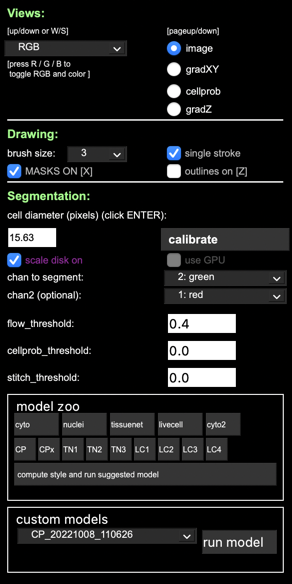
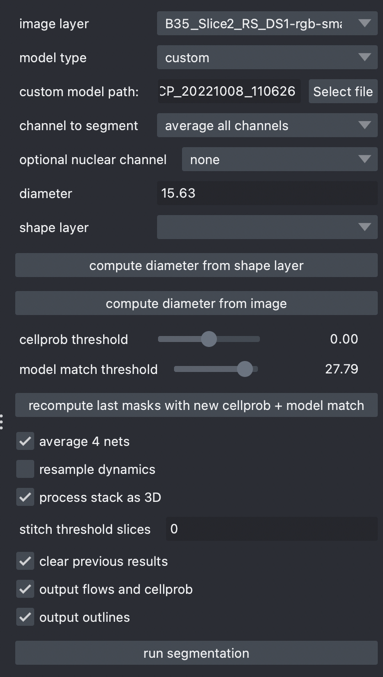

## Make oligoAnalysis a napari plugin

```
pip install cookiecutter
```

Then run cookiecutter and point to the napari tamplate

```
cookiecutter https://github.com/napari/cookiecutter-napari-plugin
```

After running cookie cutter, we get this

```
Your plugin template is ready!  Next steps:

1. `cd` into your new directory

     cd napari-dapi-ring-analysis
     # you probably want to install your new package into your env
     pip install -e .
2. Create a github repository with the name 'napari-dapi-ring-analysis':
   https://github.com/mapmanager/napari-dapi-ring-analysis.git

3. Add your newly created github repo as a remote and push:

     git remote add origin https://github.com/mapmanager/napari-dapi-ring-analysis.git
     git push -u origin main

4. The following default URLs have been added to `setup.cfg`:

    Bug Tracker = https://github.com/mapmanager/napari-dapi-ring-analysis/issues
    Documentation = https://github.com/mapmanager/napari-dapi-ring-analysis#README.md
    Source Code = https://github.com/mapmanager/napari-dapi-ring-analysis
    User Support = https://github.com/mapmanager/napari-dapi-ring-analysis/issues

    These URLs will be displayed on your plugin's napari hub page.
    You may wish to change these before publishing your plugin!
5. Read the README for more info: https://github.com/napari/cookiecutter-napari-plugin

6. We've provided a template description for your plugin page at `.napari/DESCRIPTION.md`.
   You'll likely want to edit this before you publish your plugin.

7. Consider customizing the rest of your plugin metadata for display on the napari hub:
   https://github.com/chanzuckerberg/napari-hub/blob/main/docs/customizing-plugin-listing.md
```

## training in cellpose and napari cellpose plugin

## Training in cellpose

Train model on a number of slices with rois
  - channel 1 is green: nuclei
  - channel 2 is red: oligo
  - use default 'cyto' model on a number of slices (saving each slice to npy segmented mask)
  - once we have a number of rois (Created mostly automatically by default 'cyto' model)
  - 'train' and new model using these rois (this will save)
  - then apply that model to full rgb stack and save final npy mask

When we run in cellpose app, ctrl+s to save saved <file>_seg.npy

## Training in cellpose napari plugin

When we run in cellpose napari plugin, we get a mask layer named like 'B35_Slice2_RS_DS1-rgb-small_cp_masks_000'.

In Napari, saving this to .tif leaves the filename empty? Maybe modify napari to auto-fill the filename with some version of the layer name?

We need to save this to match what we get from cellpose app.

Problem is, cellpose app saves an numpy npy and napari cellpose plugin saves a tif image


cellpose options



cellpose napari plugin options


